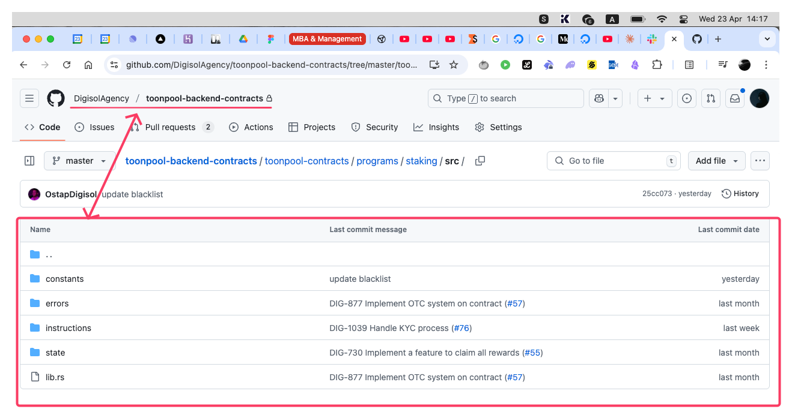

# digisol.agency application

## 2-3 relevant smart contracts you’ve written (GitHub or code snippet)

### Examples of Contracts in Solidity

1. **EVM/Router.sol** => Calculation for the amountOut for the UniswapV2/V3 integration, bulk Send/Withdraw
2. **EVM/InternalHelper.sol** and **EVM/LendingAggregator.sol** => Aggregator for fetching informating  EVM Lending Protocols for the MEV Liquidator Bot at https://github.com/0sttap/EtherFlow


### Examples of Contracts in Rust ( Solana )

3. **Solana/src/__** => Yeild Contract with 10 levels referral system, Daily Rewards, Lotto Raffle, Purchase through Radium, OTC and more.

**NOTE! Only the snippets of the actual code where provided to prevent unauthorized replication, the actual codebase is Private**



## Any past project using Axelar ITS, LayerZero, Wormhole, or similar 
AND
## Bonus: Tell us how you’d approach interchain token buy/sell logic

1. Unsatisfactory OFT Integration 

```
After evaluating LayerZero's OFT protocol implementation, our technical assessment identified limitations in cross-chain user onboarding and practical deployment scenarios. 
Despite its theoretical advantages, integration complexity and adoption metrics failed to meet our thresholds for production deployment. 
Consequently, we've migrated to Flow Blockchain, which offers superior composability characteristics and optimized user verification workflows better suited to our application requirements.
```

2. Cross-Chain Lending Protocol | Core Architecture

```
A lending protocol enabling users to collateralize BTC, ETH, or SOL across Solana and Arbitrum to borrow both traditional bank-issued fiat currency and crypto stablecoins. 
Uses Wormhole for cross-chain messaging and Fireblocks for security.
```

### Key Features
- **Dual Financial System Loans**: Issue both traditional fiat loans (USD, EUR) via banking partnerships and crypto stablecoins (USDC/USDT)
- **Real-World Banking Integration**: Connect DeFi collateral to traditional banking rails for fiat disbursement
- **Multi-Chain Collateral**: Accept and secure collateral across Solana, Arbitrum, BTC networks
- **Regulatory Compliance**: KYC/AML integration for real fiat on/off-ramps

### Technical Stack
- **Bridge**: Wormhole for cross-chain communication [Wormhole for secure message passing between chains, Guardian network validates cross-chain transactions, Token bridge handles wrapped asset issuance
- **Security**: Fireblocks for institutional-grade custody [Fireblocks provides MPC-based key management, Policy engine enforces transaction rules, Hardware security modules (HSMs) protect private keys]
- **Banking API**: Integration with banking partners for fiat disbursement
- **Chain-Specific**: Rust programs (Solana), Solidity contracts (Arbitrum), Custom Backend (BTC)

### User Experience
```
Deposit crypto collateral → Choose loan type (bank fiat or stablecoin) → Complete KYC (for bank fiat) → Receive funds in bank account or wallet → Repay through either system

The protocol bridges traditional banking with DeFi by enabling crypto-collateralized loans paid out as actual bank-issued fiat currency or crypto stablecoins.
```
